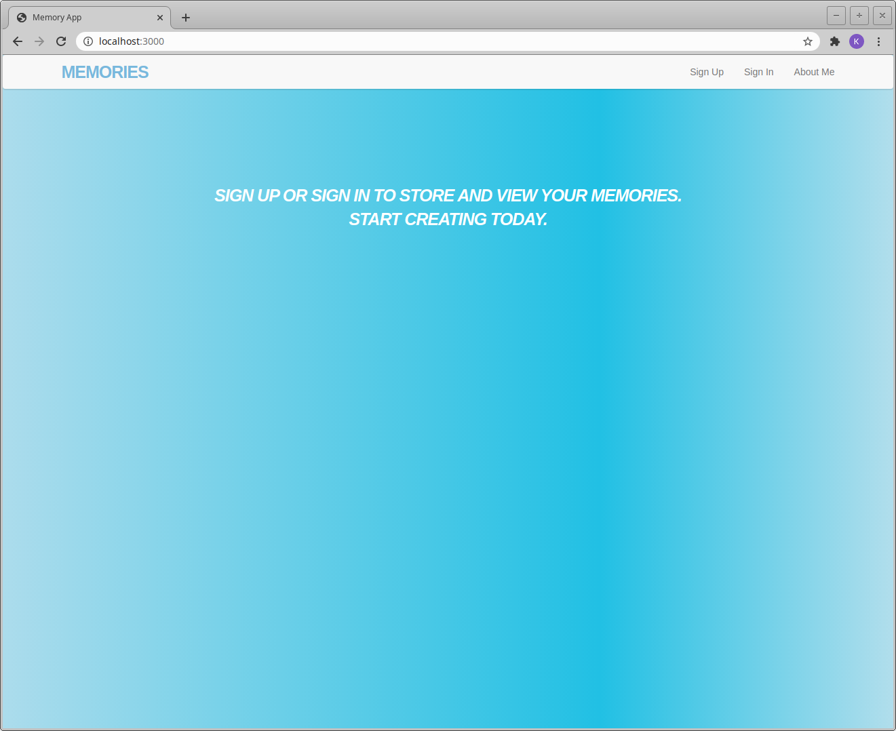
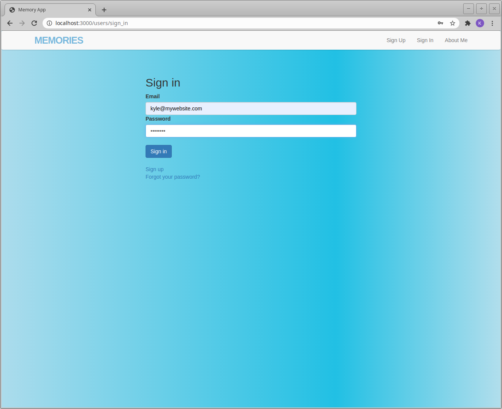
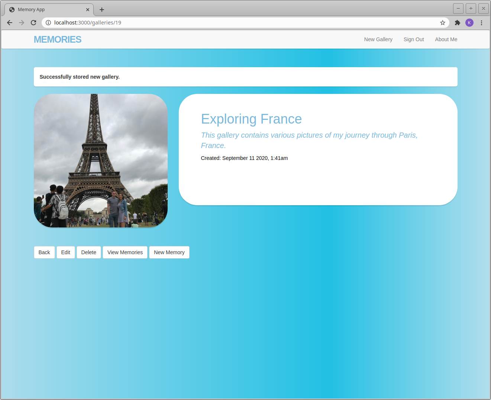
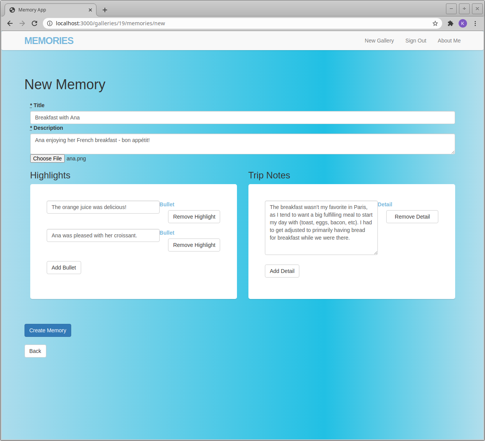
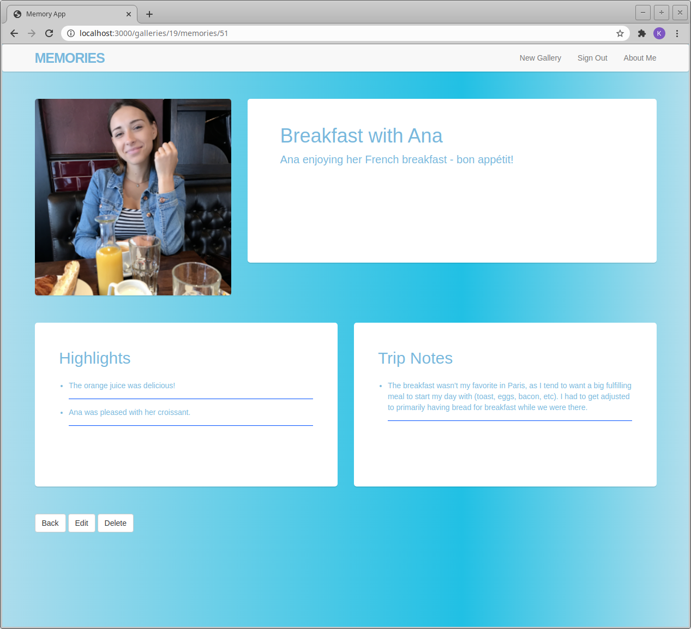
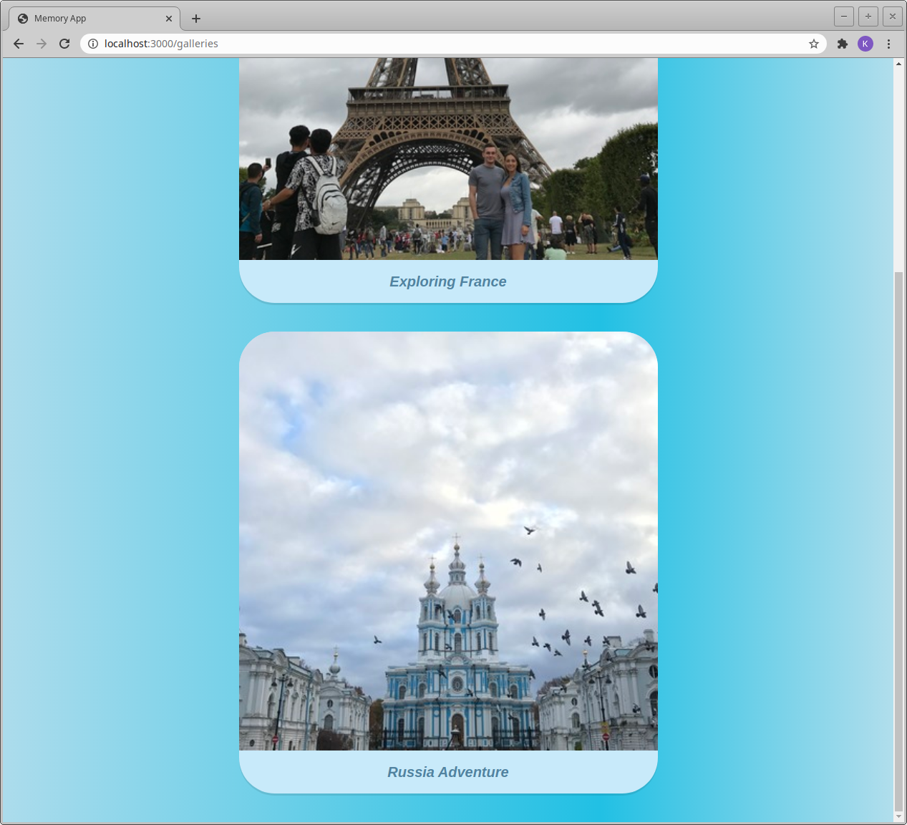
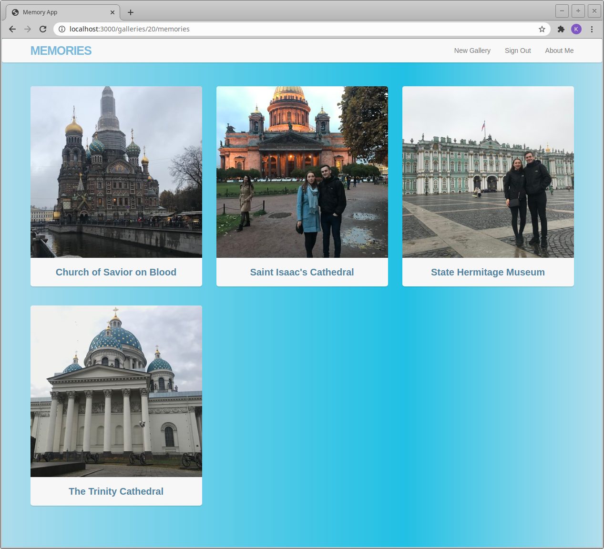

# Memories

A website to be used as a digital photo gallery.

## Installation

Ensure you have both Ruby and Rails installed on your system.

`$ ruby -v` 
`$ rails -v`

If you are able to see the versions of each you can clone the git repository, otherwise you will need to read a set up guide for Ruby on Rails.

Go to a folder on your system where you want the project to be and copy/paste:

`$ git clone git@github.com:Kfollen93/memories.git`

Install all the gems/dependencies with:

`$ bundle install`

Create the database and migrate:

`$ rake db:create` 
`$ rake db:migrate`

Enter:

`$ rails server`

This will start a local server for you to access and use the website locally.

## What I Learned

I originally got the idea from <a href="https://www.youtube.com/user/mackenziechild">Mackenzie Child's</a> Recipe Box application, but I decided to turn it into something much more. I wanted to take a project from start to finish using Rails and learn about popular gems in the process. I had built several command-line-interface Ruby programs, but not a complete website.

I spent a lot of time learning about nested resources/routes. The tutorial did not utilize any nested routes, this was something I wanted to implement into the project entirely on my own. At first I only had a display of pictures ("memories"), but I quickly realized that it would make more sense having galleries to contain my memories. Understanding how nested resources work and the corresponding routes felt like a breakthrough into what I will be able to do in my new projects now. I struggled a bit with understanding that I had to pass in both "@gallery" and "@memory" on the memories form partial, but this later ended up making sense when I started to look closer at my Rake Routes and the associations that I had created with memories belonging to a gallery.

The next part of my learning really intertwined with the gems that I had used throughout the project. Below is a brief paragraph on each gem that I used detailing my experiences:

Starting with <a href="https://rubygems.org/gems/bootstrap-sass">bootstrap-sass</a>, it had been a while since I did much HTML/CSS (and I was new to SCSS) work. I frequently visited the Bootstrap website where I did a lot of reading on how things such as the navbar, container, and column tags work. I had used a copy/pasted SCSS layout for the initial set up of the project, but I had to tweak it to get it to my liking; the original layout was very plain, but it was helpful in learning about how to set up a navbar fast and how Bootstrap's grid system works (which is built with flexbox!).

The <a href="https://rubygems.org/gems/devise">devise</a>  gem might just be my go-to gem when starting a new Rails project, it makes authentication seamless. I had used Devise before so it was not very new to me, but it did solidify my learning of how to install and set up Devise and appreciate its ease of use with methods like: "before_action :authenticate_member!", "current_user", "user_signed_in?".

Although the <a href="https://rubygems.org/gems/paperclip">paperclip</a> gem worked fine for me, I should have looked closer while doing the installation; this gem is depreciated and the better option would have been to use Rails' built in <a href="https://guides.rubyonrails.org/active_storage_overview.html">Active Storage</a>. This would have been exactly what I needed since it facilitates file uploads to storage buckets like Amazon S3, which is what I would have needed to do if I wanted to deploy the website.

I am starting to develop habits and preferences while learning Rails and at the moment, the <a href="https://rubygems.org/gems/haml">haml</a> gem is not amongst my preference. After giving it a try throughout the vanilla tutorial, I decided I could not get into it. I understand its use and it is less code overall, but while I am still learning and gaining more confidence I will stick to .erb files. Overall, I am glad I had the exposure and I know it is out there.

An awesome gem, <a href="https://rubygems.org/gems/cocoon">cocoon</a>, was really fascinating and exciting to me. I was new to nested attributes so following the tutorial with this gem helped me understand the power of it. I had to read into it a bit, specifically about how to properly use "reject_if" when I was writing some validations. I used it for the nested attributes ("Highlights" and "Trip Notes") and I can definitely see this being a gem that I use again. Also, it is worth noting that this gem depends on <a href="https://rubygems.org/gems/jquery-rails">jquery-rails</a>.

Lastly, maybe my other favorite gem at this moment, <a href="https://rubygems.org/gems/simple_form">simple_form</a>. Not only is Simple Form faster for creating forms, I also think it is easier to understand and overall much more concise and clear. This will certainly be a gem that sticks with me.

### Gem List

- <a href="https://rubygems.org/gems/bootstrap-sass">bootstrap-sass</a>
- <a href="https://rubygems.org/gems/devise">devise</a>
- <a href="https://rubygems.org/gems/paperclip">paperclip</a>
- <a href="https://rubygems.org/gems/haml">haml</a>
- <a href="https://rubygems.org/gems/cocoon">cocoon</a>
- <a href="https://rubygems.org/gems/jquery-rails">jquery-rails</a>
- <a href="https://rubygems.org/gems/simple_form">simple_form</a>

### Future Plans

 I love traveling, and having a digital photo gallery website that I created is something that I would actually use. Therefore, it is possible in the future that I will fully deploy and host this website. There are a few things that I need to do first such as switching from SQLite3 to PostgreSQL in order to be able to deploy to Heroku. In addition to this, I would want to remove the no longer supported Paperclip gem, and implement Rails' Active Storage in connection with Amazon's S3 as a storage bucket for the pictures.

## How the Memory Website Works:

1. Begin by signing up if you are new, or sign in if you are a returning user.

  
 

 2. Assuming you are a new user and you are signed in, you will be brought to a blank page with the option to create a new Gallery.

3. Once you have created the gallery it will appear like below.

4. Now, go ahead and create some memories within your gallery.

5. This is how the memory looks once finished.

6. You can create several galleries and store several memories within each!

