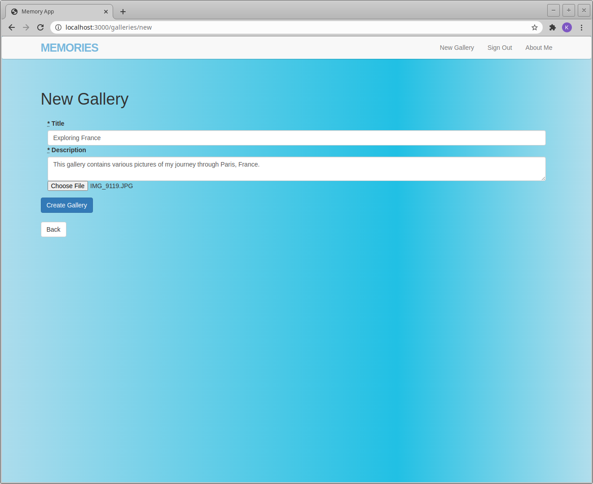

# Memories

## How the Memory Application works:

1. Begin by signing up if you are new, or sign in if you are a returning user.

  
 

 2. Assuming you are a new user and you are signed in, you will be brought to a blank page with the option to create a new Gallery.

3. Once you have created the gallery it will appear like below.

4. Now, go ahead create some memories within your gallery.

5. This is how the memory looks once finished.

6. You can create several galleries and store several memories within each!
 
